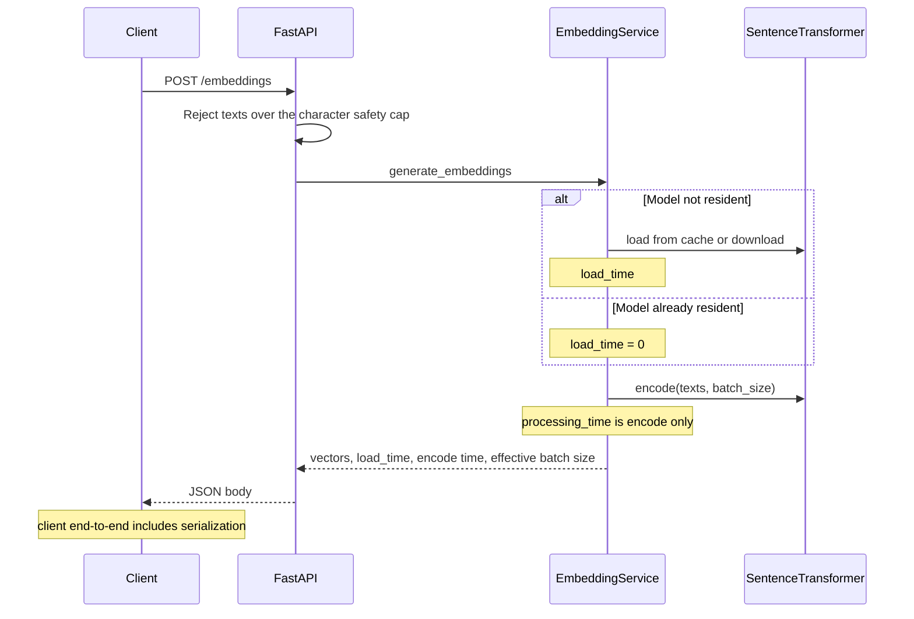

# Architecture

The service is a single-process FastAPI application. One sentence-transformer is resident at a time. Encode runs on the event loop, and the container starts one worker, so concurrent requests queue behind the forward pass.

## Request path



Token truncation happens inside the model at `max_seq_length`. That limit is the smaller of the model's own positional limit and `MAX_SEQUENCE_LENGTH`. `MAX_TEXT_CHARACTERS` is only a payload guard.

## Where each number is measured

| Phase | Clock | What it includes |
| --- | --- | --- |
| Cache miss | `load_time` on the first request after the cache directory is empty | Download plus load into RAM |
| Cold load | `load_time` after the files are on disk and the process has unloaded the model | Read into RAM |
| Warmup encode | `processing_time` of the request that just loaded the model | First forward pass |
| Steady encode | `processing_time` after two discarded warmup requests | Forward pass only |
| End-to-end | Client timer around `POST /embeddings` | Queueing, encode, and JSON |
| Memory and CPU | `GET /system`, polled during the run | API process RSS and CPU since the previous sample |

`processing_time` starts after `load_model` returns. A client that stores only that field will miss cold start. Larger embedding dimensions also inflate end-to-end time because the JSON body grows, which is why the benchmark reports encode and end-to-end separately.

## Concurrency

`POST /embeddings` is an async route that calls the encoder directly, so the forward pass blocks the event loop. With one worker, throughput stops climbing once a second request arrives during a forward pass. The load test reports that concurrency as the saturation point. The gap between mean `processing_time` and end-to-end latency at that point is queueing plus JSON.

## Retrieval evaluation

Retrieval stays outside the API. A client calls `POST /embeddings` for a corpus and for queries, ranks with a dot product over normalized vectors, and scores the ranking against BEIR SciFact qrels:

- Recall@10
- MRR@10
- nDCG@10

The comparison command runs that evaluation for three models that cover speed, retrieval training, and a larger CPU model:

- `sentence-transformers/all-MiniLM-L6-v2` (384 dimensions)
- `BAAI/bge-small-en-v1.5` (384 dimensions)
- `sentence-transformers/all-mpnet-base-v2` (768 dimensions)

## Tools

Run these from the repository root against an API that is already serving:

Create the host virtualenv once with `./scripts/setup_benchmarks.sh`, then:

```bash
.venv/bin/python -m benchmarks benchmark --base-url http://localhost:8000
.venv/bin/python -m benchmarks retrieval --base-url http://localhost:8000
.venv/bin/python -m benchmarks load --base-url http://localhost:8000
.venv/bin/python -m benchmarks compare --base-url http://localhost:8000
```

Reports are written under `results/`.
